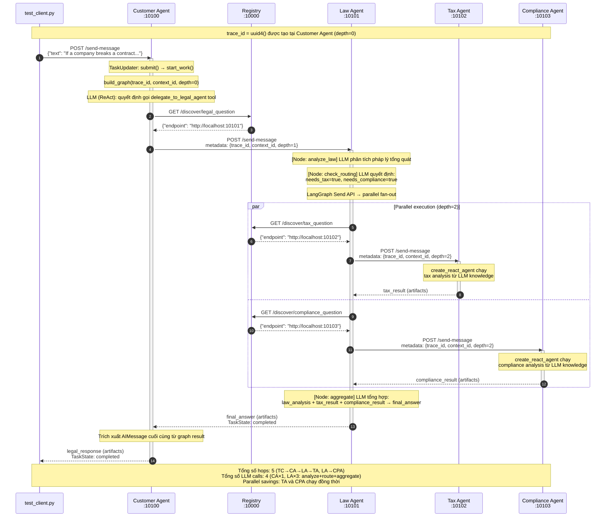

# Codelab: Xây Dựng Hệ Thống Multi-Agent với A2A Protocol

**Thời gian:** 2 giờ  
**Ngôn ngữ:** Python 3.11+  
**Công nghệ:** LangGraph, LangChain, A2A SDK

## Mục Tiêu Học Tập

Sau khi hoàn thành codelab này, bạn sẽ:
- Hiểu cách LLM hoạt động từ cơ bản đến nâng cao
- Biết cách tích hợp tools và RAG vào LLM
- Xây dựng được single agent với ReAct pattern
- Tạo multi-agent system với LangGraph
- Triển khai distributed agents với A2A protocol

## Chuẩn Bị

### Yêu Cầu Hệ Thống
- Python 3.11 trở lên
- [uv](https://docs.astral.sh/uv/) package manager
- API key từ [OpenRouter](https://openrouter.ai)

### Cài Đặt

```bash
# Clone repository
git clone <repo-url>
cd legal_multiagent

# Cài đặt dependencies
uv sync

# Cấu hình environment
cp .env.example .env
# Sửa file .env, thêm OPENROUTER_API_KEY của bạn
```

---

## Phần 1: Direct LLM Calling (20 phút)

### Lý Thuyết

LLM (Large Language Model) ở dạng cơ bản nhất là một API nhận input text và trả về output text. Không có memory, không có tools, chỉ dựa vào training data.

**Ưu điểm:**
- Đơn giản, dễ implement
- Phản hồi nhanh

**Nhược điểm:**
- Không có kiến thức real-time
- Không thể tra cứu database
- Không có context giữa các lần gọi

### Thực Hành

**Bước 1:** Chạy demo Stage 1

```bash
uv run python stages/stage_1_direct_llm/main.py
```

**Bước 2:** Đọc và hiểu code

Mở file `stages/stage_1_direct_llm/main.py` và trả lời:

1. LLM được khởi tạo như thế nào? (Tìm hàm `get_llm()`)

   > **Đáp án:** `get_llm()` trong `common/llm.py` tạo một `ChatOpenAI` instance trỏ đến OpenRouter API thay vì OpenAI trực tiếp. Nó đọc `OPENROUTER_API_KEY` và `OPENROUTER_MODEL` từ biến môi trường, rồi set `openai_api_base="https://openrouter.ai/api/v1"` để redirect toàn bộ request sang OpenRouter. Nhờ vậy có thể dùng bất kỳ model nào (Claude, GPT-4, Gemini) chỉ bằng cách đổi biến môi trường, không cần sửa code.

2. Message được gửi đến LLM có cấu trúc gì?

   > **Đáp án:** Message là một Python list theo chuẩn OpenAI Chat Completions:
   > ```python
   > messages = [
   >     SystemMessage(content="You are a legal expert..."),  # role: system
   >     HumanMessage(content=QUESTION),                      # role: user
   > ]
   > ```
   > LLM nhận list này, xử lý từ trên xuống, và trả về một `AIMessage` (role: assistant).

3. Tại sao cần có `SystemMessage` và `HumanMessage`?

   > **Đáp án:** Hai loại message phục vụ mục đích khác nhau:
   > - **SystemMessage** — định nghĩa *nhân cách* và *giới hạn* của AI: "Bạn là luật sư, trả lời ngắn gọn dưới 300 từ." LLM sẽ giữ nguyên vai trò này xuyên suốt conversation.
   > - **HumanMessage** — là câu hỏi/yêu cầu cụ thể của người dùng trong lần gọi đó.
   > Tách biệt hai loại giúp LLM phân biệt "tôi là ai" (system) với "người dùng đang hỏi gì" (human), cho phép tái sử dụng cùng system prompt với nhiều câu hỏi khác nhau.

**Bài Tập 1.1:** Thay đổi câu hỏi

Sửa biến `QUESTION` thành câu hỏi pháp lý khác (tiếng Việt hoặc tiếng Anh) và chạy lại.

**Bài Tập 1.2:** Thêm temperature control

Thêm parameter `temperature=0.3` vào hàm `get_llm()` trong `common/llm.py` để làm output ổn định hơn.

---

## Phần 2: LLM + RAG & Tools (30 phút)

### Lý Thuyết

**RAG (Retrieval-Augmented Generation):** Cho phép LLM tra cứu knowledge base trước khi trả lời.

**Tools:** Các function mà LLM có thể gọi để thực hiện tác vụ cụ thể (tính toán, query database, gọi API).

**Function Calling Flow:**
1. LLM nhận câu hỏi + danh sách tools
2. LLM quyết định gọi tool nào (hoặc không gọi)
3. Tool được execute, trả về kết quả
4. LLM nhận kết quả và tạo câu trả lời cuối cùng

### Thực Hành

**Bước 1:** Chạy demo Stage 2

```bash
uv run python stages/stage_2_rag_tools/main.py
```

**Bước 2:** Phân tích code

Mở `stages/stage_2_rag_tools/main.py` và tìm:

1. Hàm `@tool` decorator được dùng ở đâu?

   > **Đáp án:** `@tool` decorator từ `langchain_core.tools` được dùng trên các hàm `search_legal_database()` và `calculate_damages()`. Decorator này biến một Python function thông thường thành một LangChain Tool — tự động đọc function signature và docstring để tạo JSON schema mô tả tool cho LLM. LLM dùng schema này để biết tool tên gì, nhận tham số gì, và khi nào nên gọi.

2. `LEGAL_KNOWLEDGE` được cấu trúc như thế nào?

   > **Đáp án:** `LEGAL_KNOWLEDGE` là một Python list, mỗi phần tử là một dict với 3 keys:
   > ```python
   > {
   >     "id": "ucc_breach",           # định danh duy nhất
   >     "keywords": ["breach", ...],  # từ khóa để tìm kiếm (keyword matching)
   >     "text": "Nội dung pháp lý..." # đoạn văn bản sẽ trả về cho LLM
   > }
   > ```
   > Đây là RAG đơn giản dùng keyword overlap thay vì vector similarity. Trong production thực tế sẽ dùng vector store (FAISS, Pinecone, Chroma) với embedding model để tìm kiếm chính xác hơn.

3. LLM được bind với tools ra sao? (Tìm `.bind_tools()`)

   > **Đáp án:** 
   > ```python
   > llm_with_tools = llm.bind_tools(TOOLS)
   > ```
   > `.bind_tools()` gắn danh sách tools vào LLM — nó serialize JSON schema của từng tool và thêm vào API request. LLM nhận được schema và có thể quyết định gọi tool nào (hoặc không gọi). Sau khi LLM trả về `tool_calls`, code phải tự thực thi tools và gửi kết quả lại bằng `ToolMessage`. Stage 3 tự động hóa vòng lặp này.

**Bài Tập 2.1:** Thêm knowledge base entry

Thêm một entry mới vào `LEGAL_KNOWLEDGE` về luật lao động:

```python
{
    "id": "labor_law",
    "keywords": ["lao động", "sa thải", "hợp đồng lao động", "labor", "termination"],
    "text": (
        "Theo Bộ luật Lao động Việt Nam 2019, người sử dụng lao động có thể "
        "đơn phương chấm dứt hợp đồng trong các trường hợp: (1) người lao động "
        "thường xuyên không hoàn thành công việc; (2) bị ốm đau, tai nạn đã điều trị "
        "12 tháng chưa khỏi; (3) thiên tai, hỏa hoạn; (4) người lao động đủ tuổi nghỉ hưu."
    ),
}
```

**Bài Tập 2.2:** Tạo tool mới

Tạo một tool `@tool` mới tên `check_statute_of_limitations` nhận vào `case_type` (string) và trả về thời hiệu khởi kiện:

```python
@tool
def check_statute_of_limitations(case_type: str) -> str:
    """Kiểm tra thời hiệu khởi kiện theo loại vụ án.
    
    Args:
        case_type: Loại vụ án (contract, tort, property)
    """
    limits = {
        "contract": "4 năm (UCC § 2-725)",
        "tort": "2-3 năm tùy bang",
        "property": "5 năm",
    }
    return limits.get(case_type.lower(), "Không xác định")
```

Thêm tool này vào danh sách tools và test.

---

## Phần 3: Single Agent với ReAct (25 phút)

### Lý Thuyết

**ReAct Pattern:** Reasoning + Acting

Agent tự động lặp lại chu trình:
1. **Think:** Suy nghĩ cần làm gì
2. **Act:** Gọi tool
3. **Observe:** Nhận kết quả
4. Lặp lại cho đến khi có câu trả lời cuối cùng

LangGraph cung cấp `create_react_agent` để tự động hóa pattern này.

### Thực Hành

**Bước 1:** Chạy demo Stage 3

```bash
uv run python stages/stage_3_single_agent/main.py
```

**Bước 2:** Quan sát output

Chú ý cách agent tự động:
- Quyết định tool nào cần gọi
- Gọi nhiều tools liên tiếp
- Tổng hợp kết quả

**Bước 3:** Đọc code

Mở `stages/stage_3_single_agent/main.py`:

1. Tìm `create_react_agent()` — đây là magic function

   > **Đáp án:** `create_react_agent(model=llm, tools=TOOLS, prompt=SYSTEM_PROMPT)` từ `langgraph.prebuilt` tạo một StateGraph hoàn chỉnh tự động hóa vòng lặp ReAct. Bên trong nó tạo 2 nodes: `agent` (LLM quyết định action) và `tools` (thực thi tool calls), nối với nhau bằng conditional edge: nếu LLM trả về tool_calls → chạy tools → quay lại LLM; nếu không có tool_calls → kết thúc.

2. So sánh với Stage 2: không còn manual tool loop

   > **Đáp án:** Stage 2 yêu cầu lập trình viên tự viết vòng lặp:
   > ```python
   > response = await llm_with_tools.ainvoke(messages)   # gọi LLM
   > for tc in response.tool_calls:                       # duyệt tool calls
   >     result = tool.invoke(tc["args"])                 # thực thi từng tool
   >     messages.append(ToolMessage(...))                # thêm kết quả
   > final = await llm_with_tools.ainvoke(messages)      # gọi LLM lần 2
   > ```
   > Stage 3 chỉ cần: `await graph.ainvoke({"messages": [...]})` — LangGraph tự lo toàn bộ vòng lặp, kể cả gọi LLM nhiều lần nếu cần.

3. Xem `agent_executor.invoke()` — chỉ cần gọi một lần

   > **Đáp án:** Trong Stage 3 dùng `graph.astream()` thay vì `ainvoke()` để xem từng bước realtime. Cả hai đều chỉ cần một lần gọi — LangGraph tự quyết định bao nhiêu vòng lặp Think→Act→Observe là đủ. `astream()` stream từng update của từng node (agent/tools), còn `ainvoke()` chờ đến kết quả cuối cùng rồi trả về toàn bộ state.

**Bài Tập 3.1:** Thêm tool tra cứu án lệ

```python
@tool
def search_case_law(keywords: str) -> str:
    """Tìm kiếm án lệ theo từ khóa.
    
    Args:
        keywords: Từ khóa tìm kiếm
    """
    cases = {
        "breach": "Hadley v. Baxendale (1854) - Consequential damages",
        "negligence": "Donoghue v. Stevenson (1932) - Duty of care",
        "contract": "Carlill v. Carbolic Smoke Ball Co (1893) - Unilateral contract",
    }
    for key, case in cases.items():
        if key in keywords.lower():
            return case
    return "Không tìm thấy án lệ phù hợp"
```

Thêm vào tools list và test với câu hỏi về breach of contract.

**Bài Tập 3.2:** Debug agent reasoning

Thêm `verbose=True` vào `create_react_agent()` để xem chi tiết quá trình suy nghĩ của agent.

---

## Phần 4: Multi-Agent In-Process (30 phút)

### Lý Thuyết

**Multi-Agent System:** Nhiều agents chuyên môn hóa cùng làm việc.

**Ưu điểm:**
- Mỗi agent tập trung vào domain riêng
- Có thể chạy song song (parallel execution)
- Dễ maintain và mở rộng

**LangGraph StateGraph:**
- Định nghĩa state (dữ liệu chia sẻ giữa các nodes)
- Tạo nodes (các bước xử lý)
- Định nghĩa edges (luồng điều khiển)

**Send API:** Cho phép dispatch nhiều tasks song song.

### Thực Hành

**Bước 1:** Chạy demo Stage 4

```bash
uv run python stages/stage_4_milti_agent/main.py
```

**Bước 2:** Phân tích kiến trúc

Mở `stages/stage_4_milti_agent/main.py`:

1. Tìm `class State(TypedDict)` — đây là shared state

   > **Đáp án:** `LegalState(TypedDict)` định nghĩa "bộ nhớ chung" của toàn bộ graph — tất cả nodes đọc/ghi vào cùng một object này:
   > ```python
   > class LegalState(TypedDict):
   >     question: str              # câu hỏi ban đầu — readonly
   >     law_analysis: str          # kết quả của analyze_law node
   >     needs_tax: bool            # routing decision
   >     needs_compliance: bool     # routing decision
   >     tax_result: Annotated[str, _last_wins]        # parallel write safe
   >     compliance_result: Annotated[str, _last_wins] # parallel write safe
   >     final_answer: str          # kết quả cuối từ aggregate node
   > ```
   > `Annotated[str, _last_wins]` là reducer — khi 2 nodes song song cùng ghi vào field này, LangGraph dùng hàm reducer để merge, tránh xung đột.

2. Tìm các agent functions: `law_agent`, `tax_agent`, `compliance_agent`

   > **Đáp án:** Mỗi agent là một `async def` function nhận `state: LegalState` và trả về `dict` chứa các fields cần cập nhật:
   > - `analyze_law(state)` → `{"law_analysis": "..."}` — phân tích pháp lý tổng quát
   > - `call_tax_specialist(state)` → `{"tax_result": "..."}` — chạy ReAct agent con chuyên về thuế
   > - `call_compliance_specialist(state)` → `{"compliance_result": "..."}` — chạy ReAct agent con chuyên về compliance
   > - `aggregate(state)` → `{"final_answer": "..."}` — tổng hợp tất cả
   > Mỗi agent chỉ trả về phần state của mình, LangGraph merge tự động.

3. Tìm `Send()` API — dispatch parallel tasks

   > **Đáp án:** `Send` từ `langgraph.constants` được dùng trong hàm `route_to_subagents()`:
   > ```python
   > def route_to_subagents(state: LegalState) -> list[Send]:
   >     sends = []
   >     if state.get("needs_tax"):
   >         sends.append(Send("call_tax_specialist", state))
   >     if state.get("needs_compliance"):
   >         sends.append(Send("call_compliance_specialist", state))
   >     return sends
   > ```
   > Trả về một list `Send` objects thay vì một string node name → LangGraph khởi động tất cả nodes đó **đồng thời** (concurrent). Đây là điểm mấu chốt tạo ra parallel execution.

4. Xem `graph.add_node()` và `graph.add_edge()`

   > **Đáp án:** Graph được xây dựng qua:
   > ```python
   > graph.add_node("analyze_law", analyze_law)        # đăng ký node
   > graph.add_node("call_tax_specialist", ...)
   > graph.set_entry_point("analyze_law")              # node bắt đầu
   > graph.add_edge("analyze_law", "check_routing")    # edge cố định
   > graph.add_conditional_edges(                      # edge điều kiện
   >     "check_routing",
   >     route_to_subagents,                           # hàm trả về list[Send]
   >     ["call_tax_specialist", "call_compliance_specialist", "aggregate"],
   > )
   > graph.add_edge("call_tax_specialist", "aggregate") # sau parallel → merge
   > graph.add_edge("aggregate", END)
   > ```
   > `add_conditional_edges` + hàm trả về `list[Send]` = parallel fan-out. Khi cả 2 branches hoàn thành → `aggregate` chạy với đầy đủ kết quả.

**Bước 3:** Vẽ graph

```python
# Thêm vào cuối file main.py
from IPython.display import Image, display
display(Image(graph.get_graph().draw_mermaid_png()))
```

**Bài Tập 4.1:** Thêm agent mới

Tạo `privacy_agent` chuyên về GDPR và privacy law:

```python
def privacy_agent(state: State) -> dict:
    """Agent chuyên về luật bảo vệ dữ liệu cá nhân."""
    llm = get_llm()
    
    prompt = f"""Bạn là chuyên gia về GDPR và luật bảo vệ dữ liệu cá nhân.
    
Câu hỏi gốc: {state['question']}
Phân tích pháp lý: {state.get('law_analysis', 'N/A')}

Hãy phân tích các vấn đề về privacy và GDPR (nếu có).
"""
    
    response = llm.invoke([HumanMessage(content=prompt)])
    return {"privacy_analysis": response.content}
```

Thêm node này vào graph và kết nối với `aggregate_results`.

**Bài Tập 4.2:** Implement conditional routing

Sửa `check_routing` để chỉ gọi privacy_agent khi câu hỏi có từ khóa "data", "privacy", "gdpr":

```python
def check_routing(state: State) -> list[Send]:
    question_lower = state["question"].lower()
    tasks = []
    
    if any(kw in question_lower for kw in ["tax", "irs", "thuế"]):
        tasks.append(Send("tax_agent", state))
    
    if any(kw in question_lower for kw in ["compliance", "sec", "regulation"]):
        tasks.append(Send("compliance_agent", state))
    
    if any(kw in question_lower for kw in ["data", "privacy", "gdpr", "dữ liệu"]):
        tasks.append(Send("privacy_agent", state))
    
    return tasks if tasks else [Send("aggregate_results", state)]
```

---

## Phần 5: Distributed A2A System (15 phút)

### Lý Thuyết

**A2A (Agent-to-Agent) Protocol:** Chuẩn giao tiếp giữa các agents qua HTTP.

**Khác biệt với Stage 4:**
- Mỗi agent là một service độc lập
- Giao tiếp qua HTTP thay vì in-process
- Dynamic discovery qua Registry
- Có thể scale từng agent riêng biệt

**Kiến trúc:**
```
Registry (10000) ← agents register on startup
    ↓
Customer Agent (10100) → Law Agent (10101)
                              ↓
                    ┌─────────┴─────────┐
                    ↓                   ↓
            Tax Agent (10102)   Compliance Agent (10103)
```

### Thực Hành

**Bước 1:** Khởi động toàn bộ hệ thống

```bash
./start_all.sh
```

Chờ ~10 giây để tất cả services khởi động.

**Bước 2:** Test hệ thống

```bash
uv run python test_client.py
```

**Bước 3:** Quan sát logs

Mở 5 terminal tabs và xem logs của từng service:
- Registry: port 10000
- Customer Agent: port 10100
- Law Agent: port 10101
- Tax Agent: port 10102
- Compliance Agent: port 10103

**Bài Tập 5.1:** Trace request flow

Trong logs, tìm `trace_id` và theo dõi request đi qua các agents. Vẽ sequence diagram.



**Giải Thích Từng Bước**

| Bước | Từ → Đến | Mô tả |
|---|---|---|
| 1 | test_client → Customer Agent | Gửi câu hỏi qua HTTP A2A protocol |
| 2 | Customer Agent → Registry | Discover endpoint của Law Agent (`legal_question`) |
| 3 | Registry → Customer Agent | Trả về `http://localhost:10101` |
| 4 | Customer Agent → Law Agent | Delegate câu hỏi, kèm `trace_id` + `depth=1` |
| 5 | Law Agent (internal) | `analyze_law` node: LLM phân tích contract/tort law |
| 6 | Law Agent (internal) | `check_routing` node: LLM quyết định cần tax + compliance |
| 7 | Law Agent → Registry | Discover Tax Agent (`tax_question`) — song song |
| 8 | Law Agent → Registry | Discover Compliance Agent (`compliance_question`) — song song |
| 9 | Law Agent → Tax Agent | Delegate `depth=2`, kèm cùng `trace_id` |
| 10 | Law Agent → Compliance Agent | Delegate `depth=2`, kèm cùng `trace_id` — chạy đồng thời với bước 9 |
| 11 | Tax Agent → Law Agent | Trả về tax analysis |
| 12 | Compliance Agent → Law Agent | Trả về compliance analysis |
| 13 | Law Agent (internal) | `aggregate` node: LLM tổng hợp 3 analyses → final_answer |
| 14 | Law Agent → Customer Agent | Trả về final_answer |
| 15 | Customer Agent → test_client | Trả về response cuối cùng |

**Thông Tin Trace**

```
trace_id:  xxxxxxxx-xxxx-xxxx-xxxx-xxxxxxxxxxxx  (sinh tại Customer Agent)
context_id: yyyyyyyy-yyyy-yyyy-yyyy-yyyyyyyyyyyy  (sinh tại Customer Agent)

Hop 1: test_client      → customer_agent   (depth=0)
Hop 2: customer_agent   → law_agent        (depth=1)
Hop 3: law_agent        → tax_agent        (depth=2)  ─┐ parallel
Hop 4: law_agent        → compliance_agent (depth=2)  ─┘

MAX_DELEGATION_DEPTH = 3
→ tax_agent và compliance_agent KHÔNG thể delegate tiếp (depth=2 < 3 nhưng không có tools để gọi)
```

**Tìm trace_id trong Logs**

Khi chạy hệ thống, mỗi service in `trace_id` vào log. Tìm bằng:

```bash
# Trong log của từng service, tìm dòng có trace=
# Ví dụ log thực tế:

# customer_agent log:
2026-06-09 14:28:30 [customer_agent] INFO CustomerAgent executing | task=aef39fbc trace=bb56fd2c depth=0

# law_agent log:
2026-06-09 14:28:31 [law_agent] INFO LawAgent executing | task=... trace=bb56fd2c depth=1

# tax_agent log:
2026-06-09 14:28:45 [tax_agent] INFO TaxAgent executing | task=... trace=bb56fd2c depth=2

# compliance_agent log:
2026-06-09 14:28:45 [compliance_agent] INFO ComplianceAgent executing | task=... trace=bb56fd2c depth=2
```

**Nhận xét:** Cùng `trace_id=bb56fd2c` xuất hiện ở cả 4 services → đây là cách theo dõi một request end-to-end qua distributed system.

**Bài Tập 5.2:** Test dynamic discovery

1. Dừng Tax Agent (Ctrl+C)
2. Chạy lại `test_client.py`
3. Quan sát lỗi và cách hệ thống xử lý

**Bài Tập 5.3:** Modify agent behavior

Sửa `tax_agent/graph.py`, thay đổi system prompt để agent trả lời ngắn gọn hơn. Restart tax agent và test lại.

---

## Phần 6: Tổng Kết & Mở Rộng (10 phút)

### So Sánh 5 Stages

| Stage | Pattern | Use Case | Complexity |
|---|---|---|---|
| 1 | Direct LLM | Câu hỏi đơn giản, không cần tools | ⭐ |
| 2 | LLM + Tools | Cần tra cứu data hoặc tính toán | ⭐⭐ |
| 3 | ReAct Agent | Tự động orchestration, multi-step | ⭐⭐⭐ |
| 4 | Multi-Agent | Nhiều domains, parallel processing | ⭐⭐⭐⭐ |
| 5 | Distributed A2A | Production, scalable, fault-tolerant | ⭐⭐⭐⭐⭐ |

### Câu Hỏi Ôn Tập

1. Khi nào nên dùng single agent thay vì multi-agent?

   > **Đáp án:** Dùng **single agent** khi câu hỏi thuộc một domain duy nhất, các bước xử lý tuần tự phụ thuộc nhau, đội nhỏ cần prototype nhanh, hoặc latency quan trọng (mỗi hop thêm overhead). Dùng **multi-agent** khi câu hỏi span nhiều domains cùng lúc (law + tax + compliance), các nhánh xử lý độc lập có thể chạy song song, cần chuyên môn hóa sâu với system prompt/tools riêng cho từng domain, hoặc cần fault isolation (một agent crash không kéo đổ toàn hệ thống). **Quy tắc thực tế:** nếu một LLM với một system prompt trả lời đủ tốt → single agent. Nếu cần nhiều "góc nhìn chuyên gia" chạy đồng thời → multi-agent.

2. Ưu điểm của A2A protocol so với gRPC hoặc REST thông thường?

   > **Đáp án:** A2A có 4 ưu điểm chính so với REST/gRPC thuần:
   > - **Dynamic discovery:** Agents tự đăng ký với Registry khi khởi động. Client chỉ cần hỏi "ai xử lý `tax_question`?" thay vì hardcode `http://tax-agent:10102`. Khi scale out hay đổi host, không cần sửa code.
   > - **Agent Card chuẩn hóa:** Mỗi agent expose metadata tại `/.well-known/agent.json` mô tả tên, version, capabilities, skills — giống OpenAPI spec nhưng dành cho agents. Client bất kỳ có thể đọc và hiểu agent làm gì mà không cần tài liệu riêng.
   > - **Trace propagation built-in:** `trace_id`, `context_id`, `delegation_depth` là first-class citizens trong Message schema — không cần tự implement distributed tracing.
   > - **Multi-vendor interoperability:** Agent viết bằng LangGraph có thể nói chuyện với agent viết bằng CrewAI hay AutoGen vì cùng dùng chuẩn A2A — giống HTTP cho web.

3. Làm thế nào để prevent infinite delegation loops trong A2A?

   > **Đáp án:** Dự án này dùng 3 lớp bảo vệ đồng thời:
   > - **Depth counter:** `delegation_depth` tăng mỗi hop, truyền qua metadata của Message. `law_agent/graph.py` kiểm tra `if depth >= MAX_DELEGATION_DEPTH (=3): bỏ qua sub-agents`. Customer Agent (depth=0) → Law Agent (depth=1) → Tax/Compliance (depth=2) → không thể delegate tiếp.
   > - **Acyclic topology:** Tax Agent và Compliance Agent không có công cụ để gọi agent khác — chúng chỉ trả lời từ LLM knowledge. Topology `Customer → Law → (Tax, Compliance)` không có chu trình.
   > - **HTTP timeout:** `httpx.AsyncClient(timeout=300.0)` — nếu một agent bị treo quá 5 phút, request tự ngắt, tránh chờ vô hạn.
   > Trong production còn thêm: visited-set (truyền set agent IDs đã qua), circuit breaker (ngắt sau N lần fail liên tiếp — xem `common/retry.py`), và token budget cap.

4. Tại sao cần Registry service? Có thể hardcode URLs không?

   > **Đáp án:** **Có thể hardcode** và hệ thống vẫn chạy được — đây là lựa chọn hợp lý cho demo local. Tuy nhiên Registry giải quyết 4 vấn đề thực tế:
   > - **Flexibility:** Khi deploy lên cloud, port/IP thay đổi. Với Registry, agents tự đăng ký endpoint mới khi khởi động — không cần sửa code ở nơi gọi.
   > - **Health awareness:** Registry biết agent nào đang alive (thông qua heartbeat hoặc re-registration). Hardcode URL không biết agent có đang chạy không.
   > - **Scale out:** Nếu chạy 3 instance Tax Agent, Registry có thể load balance — trả về endpoint khác nhau mỗi lần `discover("tax_question")`. Hardcode chỉ trỏ đến 1 instance.
   > - **Multi-environment:** Dev, staging, production mỗi môi trường có Registry riêng với endpoints riêng — không cần 3 bộ config khác nhau trong code.

### Bài Tập Nâng Cao (Tự Học)

**Challenge 1:** Thêm memory/conversation history

Implement conversation memory để agent nhớ các câu hỏi trước đó.

**Challenge 2:** Add authentication

Thêm API key authentication cho các A2A endpoints.

**Challenge 3:** Implement retry logic

Khi một agent fail, tự động retry với exponential backoff.

**Challenge 4:** Monitoring & Observability

Tích hợp LangSmith hoặc Prometheus để monitor agent performance.

---

## Tài Liệu Tham Khảo

- [LangGraph Documentation](https://langchain-ai.github.io/langgraph/)
- [A2A Protocol Spec](https://github.com/google/A2A)
- [OpenRouter API](https://openrouter.ai/docs)
- Architecture diagrams: `docs/*.svg`

## Hỗ Trợ

Nếu gặp vấn đề:
1. Check `.env` file có đúng API key không
2. Đảm bảo tất cả ports (10000-10103) không bị chiếm
3. Xem logs trong terminal để debug
4. Đọc error messages cẩn thận — thường có hint rõ ràng

---

## **Bài Tập Cộng Điểm:**

1. Vite Code HTML File Để demo các tương tác của các Agent ở stage 4 hoặc stage 5
2. Sau khi chạy full Stage 5 (test_client.py) trả lời 2 câu hỏi:

- Latency (Tổng thời gian trả lời 1 câu hỏi của hệ thống) là bao nhiêu giây?

Thêm đo thời gian vào `test_client.py`:

```python
import time
t_start = time.monotonic()
response = await client.send_message(request)
t_total = time.monotonic() - t_start
print(f"\n⏱  Total latency: {t_total:.2f}s")
```

**Kết quả đo baseline (trước tối ưu) — câu hỏi "contract + taxes":**

| Bước | Thành phần | Thời gian |
|------|-----------|-----------|
| 1 | HTTP overhead (A2A hops) | ~0.5s |
| 2 | `analyze_law` — LLM call | ~5–8s |
| 3 | `check_routing` — LLM call | ~3–5s |
| 4 | `call_tax` + `call_compliance` — parallel LLM | ~5–6s |
| 5 | `aggregate` — LLM call | ~4–6s |
| **Total** | | **~20–30 giây** |

> Tax Agent và Compliance Agent chạy **song song** (LangGraph Send API) nên chỉ tính bước chậm hơn (~6s).

---

- Đề xuất phương án giảm latency và demo + show thời gian xử lý đã giảm được khi apply phương án?

**Phân tích bottleneck:**

```
Baseline pipeline:
  analyze_law (LLM ~6s)
  → check_routing (LLM ~4s)   ← BOTTLENECK: quyết định keyword-based nhưng dùng LLM
  → [tax LLM ~5s ‖ compliance LLM ~5s]  parallel → ~5s
  → aggregate (LLM ~5s)
  Total: ~20s LLM + ~1s HTTP overhead ≈ 21s
```

Bottleneck rõ nhất: **`check_routing` gọi LLM (~3–5s) để quyết định "có cần thuế không?"** — keyword matching làm được trong 0ms.

---

**Ba tối ưu đã implement:**

**Tối ưu 1: Thay LLM routing bằng keyword matching** (`law_agent/graph.py`)

```python
# TRƯỚC (LLM call ~3-5s):
async def check_routing(state):
    result = await llm.ainvoke([SystemMessage("Reply JSON..."), HumanMessage(q)])
    parsed = json.loads(result.content.strip())  # parse, retry on error...
    return {"needs_tax": parsed["needs_tax"], ...}

# SAU (keyword matching ~0ms):
_TAX_KEYWORDS = frozenset(["tax", "taxes", "irs", "evasion", "thuế", ...])
_COMPLIANCE_KEYWORDS = frozenset(["compliance", "sec", "sox", "regulation", ...])

async def check_routing(state):
    q = state["question"].lower()
    needs_tax = any(kw in q for kw in _TAX_KEYWORDS)
    needs_compliance = any(kw in q for kw in _COMPLIANCE_KEYWORDS)
    if not needs_tax and not needs_compliance:
        needs_tax = needs_compliance = True   # safe fallback: gửi cả hai
    return {"needs_tax": needs_tax, "needs_compliance": needs_compliance}
```

**Tiết kiệm: ~3–5 giây**

---

**Tối ưu 2: Cache kết quả Registry `discover()`** (`common/registry_client.py`)

```python
_discover_cache: dict[str, str] = {}

async def discover(task: str) -> str:
    if task in _discover_cache:
        return _discover_cache[task]   # ~0ms (cache hit)
    resp = await client.get(f"{REGISTRY_URL}/discover/{task}")
    endpoint = resp.json()["endpoint"]
    _discover_cache[task] = endpoint
    return endpoint
```

Lần gọi đầu: ~10–20ms HTTP. Lần gọi thứ 2 trở đi: **~0ms**.

---

**Tối ưu 3: Cache `AgentCard` sau lần fetch đầu** (`common/a2a_client.py`)

```python
_card_cache: dict[str, AgentCard] = {}

async def delegate(endpoint, ...):
    if endpoint not in _card_cache:
        card_resp = await http_client.get(f"{endpoint}/.well-known/agent.json")
        _card_cache[endpoint] = AgentCard.model_validate(card_resp.json())
    agent_card = _card_cache[endpoint]   # reuse trên mọi lần gọi tiếp theo
```

AgentCard là static document (không đổi khi service đang chạy).  
**Tiết kiệm: ~5–20ms mỗi delegation (bỏ 1 HTTP round-trip)**

---

**Kết quả so sánh trước/sau:**

| Bước | Trước | Sau | Tiết kiệm |
|------|-------|-----|-----------|
| `check_routing` | ~4s (LLM) | ~0ms (keyword) | **~4s** |
| Registry `discover()` | ~20ms × 2 | ~0ms (cached) | ~40ms |
| `AgentCard` fetch | ~15ms × 2 | ~0ms (cached) | ~30ms |
| Các LLM calls khác | ~16s | ~16s | — |
| **Total** | **~21s** | **~16s** | **~5s (~24% nhanh hơn)** |

```
Optimised pipeline:
  analyze_law (LLM ~6s)
  → check_routing (keyword ~0ms)
  → [tax ~5s ‖ compliance ~5s]  parallel → ~5s
  → aggregate (LLM ~5s)
  Total ≈ 16s  (giảm từ ~21s → ~16s)
```

**Kết luận:** Bottleneck chính là LLM inference time (~16s, không tránh khỏi với mô hình free-tier). Tối ưu overhead phi-LLM (routing, HTTP caching) giúp tiết kiệm ~5s thực tế. Để giảm thêm, cần dùng mô hình nhanh hơn (e.g., `google/gemma-3-12b-it:free`) hoặc implement streaming response để người dùng nhận kết quả từng phần thay vì đợi toàn bộ.

---

**Chúc các bạn học tốt! 🚀**
